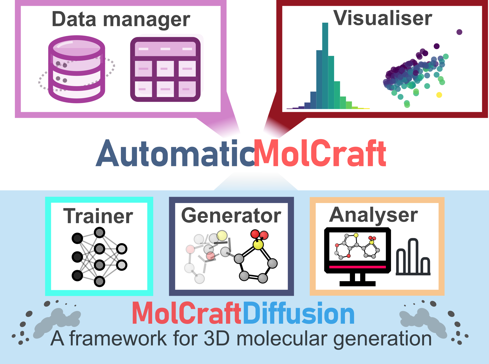

# AutomaticMolCraft

<p align="center">
  
</p>

<p align="center">
  <a href="https://chemrxiv.org/engage/chemrxiv/article-details/6909e50fef936fb4a23df237">
    
  </a>
  <a href="https://zenodo.org/records/18121166">
    
  </a>
  <a href="https://huggingface.co/pregH/MolecularDiffusion">
    
  </a>
  <a href="https://preghosh.github.io/AutomaticMolCraftt/">
    
  </a>
  <a href="LICENSE">
    
  </a>
</p>

---

A browser-based platform for the full 3D molecular generative design pipeline: run pretrained [MolCraftDiffusion](https://github.com/pregHosh/MolCraftDiffusion) models, curate and enrich datasets, and explore chemical space — all from one web interface, no scripting required.

## Features

| | |
|---|---|
| **De-novo & property-guided generation** | DDPM/DDIM sampling with classifier-free guidance toward per-property targets, run directly from the browser |
| **Structure-guided generation** | Inpaint or outpaint from a reference `.xyz` scaffold, with tunable denoising/constraint strength |
| **Model training** | Configure, queue, monitor, and export MolCraftDiff training jobs from a form or an imported YAML |
| **Multi-source data curation** | Stage and compile CSV+XYZ, ASE `.db`, and generation-job outputs into one dataset |
| **Analysis pipeline** | Async jobs for validity/connectivity checks, XTB properties and geometry optimization, featurization, dimensionality reduction, and property prediction |
| **Linked visualization** | 2D/3D scatter, histograms, and a 3D molecule viewer sharing one selection state, GPU-rendered via deck.gl |
| **Plug-in tools** | Wire in external property predictors by dropping a `manifest.json` + `runner.py` — no backend changes needed |

## Installation

```bash
conda create -n molcraft python=3.11 -y
conda activate molcraft
conda install -c conda-forge xtb==6.7.1 openbabel -y
```

**Pinned to MolCraftDiffusion commit `b79e8aadc85f7047fbd9a70d1c41ea3aba0fc0a7`** (version 1.12.0) — not on PyPI, install from the exact commit:

```bash
MOLCRAFT_REF=b79e8aadc85f7047fbd9a70d1c41ea3aba0fc0a7
pip install "molcraftdiffusion[gpu] @ git+https://github.com/pregHosh/MolCraftDiffusion@${MOLCRAFT_REF}" \
    --find-links https://data.pyg.org/whl/torch-2.6.0+cu124.html   # or [cpu] with the CPU torch index
```

Download [pretrained models from Hugging Face](https://huggingface.co/pregH/MolecularDiffusion) into `models/`, then launch:

```bash
cp webapp/database-explorer-lite/.env.example webapp/database-explorer-lite/.env
./dev.sh
```

Open `http://localhost:8000`. See the [installation guide](https://preghosh.github.io/AutomaticMolCraftt/installation/) for environment variables, GPU/CPU builds, and dev-mode options.

## Usage

The WebUI has seven tabs:

| Tab | Purpose |
|---|---|
| **Visualization** | Explore the compiled dataset with linked plots, filters, and the 3D viewer |
| **Management** | Register, compile, filter, and export datasets |
| **3D molecule generation** | De-novo or property-guided generation |
| **Structure-directed generation** | Inpaint/outpaint from a reference structure |
| **Analysis tools** | Queue analysis jobs or build multi-step workflows |
| **Model training** | Configure, queue, and monitor MolCraftDiff training jobs |
| **Plug-in tools** | Run locally installed external tools |

See the [tutorials](https://preghosh.github.io/AutomaticMolCraftt/) for a full walkthrough of each tab.

## Documentation

- [Installation](https://preghosh.github.io/AutomaticMolCraftt/installation/)
- [Quick Start](https://preghosh.github.io/AutomaticMolCraftt/quickstart/)
- [UI Overview](https://preghosh.github.io/AutomaticMolCraftt/ui-overview/)
- [Analysis Tools](https://preghosh.github.io/AutomaticMolCraftt/analysis-tools/)
- [Model Training](https://preghosh.github.io/AutomaticMolCraftt/training/)
- [FAQ](https://preghosh.github.io/AutomaticMolCraftt/faq/)
- [MolCraftDiffusion Repository & Docs](https://github.com/pregHosh/MolCraftDiffusion) · [Docs](https://preghosh.github.io/MolCraftDiffusion/)

## Citation

If you use **AutomaticMolCraft** in your research, please cite:

### AutomaticMolCraft

[](https://github.com/pregHosh/AutomaticMolCraftt)

_Citation placeholder — no preprint/DOI for AutomaticMolCraft itself yet._

If you use **MolCraftDiffusion**, the generative engine this app is built on, please cite:

### MolCraftDiffusion

[](https://pubs.acs.org/doi/10.1021/jacs.5c19960)

[Modular Framework for 3D Molecular Generation in Computational Chemistry Applications](https://pubs.acs.org/doi/10.1021/jacs.5c19960)

```bibtex
@article{worakul_modular_2026,
	title = {Modular {Framework} for {3D} {Molecular} {Generation} in {Computational} {Chemistry} {Applications}},
	copyright = {https://creativecommons.org/licenses/by/4.0/},
	issn = {0002-7863, 1520-5126},
	url = {https://pubs.acs.org/doi/10.1021/jacs.5c19960},
	doi = {10.1021/jacs.5c19960},
	language = {en},
	urldate = {2026-06-24},
	journal = {Journal of the American Chemical Society},
	author = {Worakul, Thanapat and Azzouzi, Mohammed and Wodrich, Matthew D. and Corminboeuf, Clémence},
	month = jun,
	year = {2026},
	pages = {jacs.5c19960},
}
```

### Related Paper

[](https://chemrxiv.org/doi/full/10.26434/chemrxiv.15005231/v1)

[A Diffusion Framework for Geometrically Valid and Practically Viable 3D Molecular Generation](https://chemrxiv.org/doi/full/10.26434/chemrxiv.15005231/v1)

```bibtex
@article{worakul_diffusion_2026,
	title = {A {Diffusion} {Framework} for {Geometrically} {Valid} and {Practically} {Viable} {3D} {Molecular} {Generation}},
	url = {https://chemrxiv.org/doi/full/10.26434/chemrxiv.15005231/v1},
	doi = {10.26434/chemrxiv.15005231/v1},
	publisher = {American Chemical Society (ACS)},
	author = {Worakul, Thanapat and Corminboeuf, Clémence},
	month = jun,
	year = {2026},
}
```

## License

This project is released under the MIT License.
