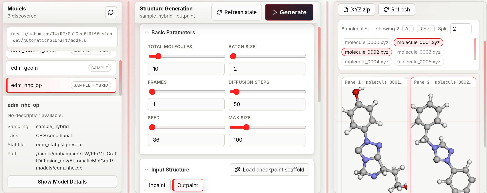

# De-novo Generation

De-novo generation produces 3D molecular structures from random noise — no reference structure is needed. The model runs the reverse of the diffusion process (noise → molecule) using the distribution it learned during training.

## Layout

The tab has three resizable columns. Drag the vertical dividers to adjust their widths.

| Column | Contents |
|---|---|
| **Models** (left) | Checkpoint list, model metadata, training-distribution histograms |
| **Generation** (centre) | Parameter controls, presets bar |
| **Results** (right) | Job status, live log, molecule viewer, download buttons |

*The generation workspace exposes model selection, sampling parameters, conditional-generation controls, job execution, generated-structure inspection, and registration of generated molecules for downstream curation and analysis.*

---

## Workflow

### 1. Select a model

The Models panel lists every folder containing `edm_chem.pkl` found in `MOLCRAFT_MODELS_DIR`. The grey path below the list shows where the app is searching.

- A model badge showing **CFG** means it was trained with property labels and supports conditional generation.
- A badge showing **Unconditional** means it generates freely with no property steering.

Click **Show Model Details** to inspect:
- Architecture name and parameter count
- All training hyperparameters
- **Training-set property distributions** as mini histograms — click **Expand** on any histogram to see a full-size chart with axis ticks. These distributions tell you what property ranges the model has seen, which helps you choose realistic CFG targets.

### 2. Configure parameters

See the [parameter reference](#parameter-reference) below.

### 3. Run

Click **Generate** (top-right of the centre panel) or press **Shift+Enter**.

The Results panel shows a status badge: `queued → running → completed` (or `failed`). The log tail updates every 2 seconds. You can click **Stop** (square icon) to cancel a running job.

### 4. Inspect results

When molecules are ready, their filenames appear as pills in the results list:

- **Click a pill** to load that molecule into the viewer pane.
- **Split** (dropdown, 1–9): set how many panes are shown side-by-side.
- **All** button: load the first 9 molecules at once.
- **Reset** button: clear all displayed molecules.

In each pane:

- **Rotate**: left-click drag · **Zoom**: scroll wheel
- Toggle between **3D** and **Denoising** (appears only if Frames > 1)

### 5. Download

| Button | Output |
|---|---|
| **XYZ** | Single molecule coordinate file |
| **SVG** | Server-rendered 3D projection via OpenBabel |
| **XYZ zip** | All molecules from the job in one archive |

### 6. Send to structure-guided generation

With a molecule selected in a pane, click **→ Use as ref** to load that XYZ directly as a scaffold in the [Structure-directed generation](structure-guided.md) tab.

---

## Parameter reference

### Basic parameters

| Parameter | Default | Range | Chemical meaning |
|---|---|---|---|
| **Total molecules** | 1 | ≥ 1 | Number of independent XYZ files produced in this job |
| **Batch size** | 1 | 1–256 | How many molecules are sampled in a single forward pass through the diffusion model. Larger batches are faster per molecule but use more GPU memory. Must be less than Total molecules |
| **Frames** | 1 | 1–100 | Number of trajectory snapshots captured during denoising. Set to 1 to save only the final structure (fastest). Set > 1 to enable step-by-step denoising playback |
| **Diffusion steps** | 50 | 2–1 000 | Number of denoising steps. More steps produce smoother, higher-quality geometries at the cost of run time. For quick exploration 20–50 is sufficient; for final structures 100–200 is typical |
| **Seed** | 86 | 0–999 999 | Random seed for reproducibility. Change it to sample a different region of chemical space with the same settings |

### Molecular size

Three modes control how many atoms each generated molecule has:

| Mode | Parameters | When to use |
|---|---|---|
| **random** | *(none)* | Sample atom count from the training distribution — the most diverse option |
| **fixed** | Fixed atom count (1–512) | Force every molecule to have exactly this many heavy atoms |
| **range** | Min (1–512) + Max (1–512) | Sample atom count uniformly within the specified window |

In **random** mode, the **Max size** field (visible in Basic Parameters) acts as a global upper cap on atom count regardless of what the model might sample.

### Conditional targets *(CFG models only)*

**CFG scale** (0–5, step 0.1, default 1): controls how strongly the model steers toward the specified property targets.

- **0**: equivalent to unconditional generation — property targets are ignored entirely.
- **1**: mild guidance; the model balances diversity with property steering.
- **2–5**: stronger guidance; output properties are closer to the targets but structural diversity decreases. Values above 3 can produce geometrically strained structures.

!!! note "Guidance quality trade-off"
    Increasing CFG scale strengthens property steering but typically reduces the fraction of generated structures that pass geometric validity checks (e.g. PoseBuster). This trade-off is sensitive to how the model was trained: models with MAD-normalized property targets tend to retain higher structural quality at equivalent CFG strengths compared to models trained with fixed-scale normalization. Check the training-set property histograms (visible in **Show Model Details**) to choose a realistic target value — requesting a property far outside the training distribution reduces both guidance effectiveness and structural quality.

For each property the model was trained with:

| Field | Range | Description |
|---|---|---|
| **Target** | −20 to 20 | The property value to steer toward. Check the training-set histogram to see realistic values for this model |
| **Negative** | −20 to 20 (or `−`) | A contrastive target to steer *away from* — the model maximises the difference between target and negative. Type `−` to leave it unset |

**Constraint**: all properties must either all have a negative target set or all have it unset. Mixed configuration is rejected at submission time.

---

## Denoising trajectory playback

When **Frames** > 1, each result pane shows a **3D / Denoising** toggle.

- **3D**: shows the final generated geometry.
- **Denoising**: plays back the full reverse-diffusion trajectory as an animated GIF — each frame is one captured denoising step, letting you observe how the point cloud collapses from noise into a molecule.

The GIF is rendered server-side; a "Rendering…" message appears while it loads.

---

## Configuration presets

See [Presets](presets.md) — save and restore the full parameter state for any generation configuration.

---

## Reloading past jobs

Click **Refresh state** to re-discover completed jobs from disk. Any job in `MOLCRAFT_OUTPUTS_DIR` can be reloaded into the viewer without re-running the model.
