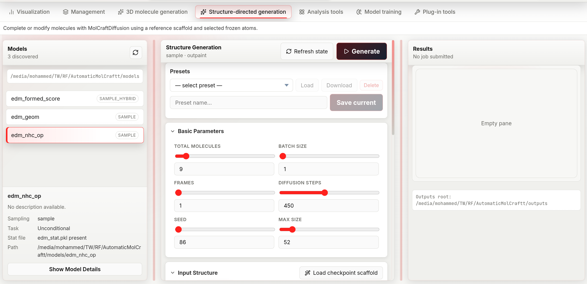

# Structure-guided Generation

Structure-guided generation completes or extends an existing 3D structure. You provide a **scaffold** — a partial or complete molecule in XYZ format — and select which atoms are frozen. The model places new atoms around or within those fixed positions.

Three modes define what "guiding with a scaffold" means:

- **Inpaint**: frozen atoms are interior anchors; the model fills in atoms *within* the structure (e.g. completing missing side chains or bridging two fragments).
- **Outpaint**: frozen atoms are attachment points; the model grows *new atoms around* them (e.g. adding a substituent or extending a ring), connected by an explicit bond order per attachment point.
- **Outpaintft** (outpaint, freeze-thaw): like Outpaint, but the scaffold's frozen coordinates are only held rigid until a threshold step in the schedule (`t_critical`), then released to relax for the rest of denoising — useful when strict rigidity produces strained geometry at the attachment point. It ignores bond-order connectors, and it only supports unconditional (non-CFG) guidance — submitting it against a CFG-capable model is rejected.

The tab layout is identical to [De-novo generation](index.md) — three resizable columns: Models, Generation, Results. All model selection, result inspection, download, and preset functionality work the same way.

*The structure-guided workspace mirrors de-novo generation, with a presets bar and an Input Structure section for loading a reference scaffold and choosing inpaint/outpaint/outpaintft mode.*

---

## Workflow

### 1. Select a model

Same as in [de-novo generation](index.md#1-select-a-model), except the model list badge here shows the sampling mode directly instead of CFG/Unconditional:

- **sample_hybrid** — the model was trained with property labels; property targets are available alongside structural guidance.
- **sample** — the model is unconditional; structural constraints are enforced through a geometric penalty, and the Adjustment Panel exposes additional low-level controls for this mode.

The selected-model detail card repeats this as a **Sampling** row, plus a **Task** row using the CFG conditional / Unconditional wording.

### 2. Choose inpaint, outpaint, or outpaintft

The **Input Structure** section opens with an **inpaint / outpaint / outpaintft** segmented button — pick a mode before or after loading a scaffold, since it also controls how the atom-count fields are pre-filled once a scaffold loads (see next step).

| Mode | Scaffold role | Use when |
|---|---|---|
| Inpaint | Frozen atoms define the surrounding context | You want to fill a hole or replace a fragment inside a known structure |
| Outpaint | Frozen atoms are the core; new atoms grow outward, attached with an explicit bond order | You want to decorate or extend a known fragment and control the attachment bond order |
| Outpaintft | Frozen atoms are the core but only held rigid until `t_critical`, then released | You want to extend a fragment while avoiding strain at the attachment point. Unconditional models only — rejected if the model has CFG properties |

### 3. Load a scaffold

Three ways to provide the reference XYZ:

**File upload** — in the **Input Structure** section, click the file picker and select a `.xyz` file, or drag and drop a `.xyz` file anywhere in the section.

**Path input** — type or paste an absolute path into the text box and press **Enter** or click the arrow button.

**Checkpoint scaffold** — if the selected model was trained with a reference scaffold, the **Load checkpoint scaffold** button appears next to the section title. Clicking it:
1. Fetches the scaffold XYZ embedded in the checkpoint.
2. Switches mode to **Outpaint** automatically.
3. Pre-selects the atoms that were frozen during training.

Once a scaffold loads, its 3D structure appears in an interactive viewer and the atom count fields are auto-populated from the scaffold's atom count: Min = scaffold atoms; Fixed atom count = scaffold atoms for **Inpaint** mode, or scaffold atoms + 1 for **Outpaint** / **Outpaintft** mode (since those modes must add at least one new atom). Loading via **Checkpoint scaffold** always uses the +1 form, since it switches to Outpaint automatically.

### 4. Select frozen atoms

Click atoms in the 3D viewer to toggle them between frozen (highlighted) and free. Right-click anywhere in the viewer to clear all selections.

Selected atom indices appear as removable chips below the viewer — click a chip's ✕ to deselect that atom.

Outpaint and Outpaintft require at least one selected atom, unless the Adjustment Panel's Init method is set to `seed` with BQ atoms > 0 — in that case the model anchors on its own placeholder atoms instead of a connector. Inpaint works with any number of selected atoms (including zero, which is equivalent to de-novo generation with a positional prior).

### 5. Set connector bonds *(outpaint only)*

For each selected atom, set the **bond order** to the newly generated atoms using the number field labelled `Connector <index>` (range 1–8). This controls the order of the bond(s) formed between the scaffold and the new fragment:

- `1` = single bond (default — safe for any attachment point)
- `2` = double bond (use for carbonyl or vinyl attachments)
- `3` = triple bond (use sparingly)

Higher bond orders constrain the geometry more tightly. Outpaintft mode does not use this field — it always attaches new atoms without an explicit bond-order constraint.

### 6. Configure parameters and run

See the [parameter reference](#parameter-reference) below. Click **Generate** or press **Shift+Enter**.

---

## Parameter reference

### Basic parameters

Identical to [de-novo generation](index.md#basic-parameters): Total molecules, Batch size, Frames, Diffusion steps, Seed, Max size. There is no Sampler or CFG scale schedule control on this tab — those are de-novo-only.

### Molecular size

| Mode | Fields |
|---|---|
| **fixed** | Fixed atom count (1–512) — total atoms including frozen scaffold atoms |
| **range** | Min (1–512) + Max (1–512) |

Setting Fixed atom count to scaffold size + N tells the model to add approximately N new atoms around the scaffold.

### Inpaint-specific

| Parameter | Default | Range | Chemical meaning |
|---|---|---|---|
| **Denoising strength** | 0.5 | 0–1, step 0.05 | How much of the original scaffold geometry is preserved. At 0 the output is almost identical to the reference; at 1 the reference is fully noised and re-denoised from scratch — the model has the most freedom but the output may diverge significantly from the scaffold |

### Conditional targets *(CFG / sample_hybrid models only)*

Identical to [de-novo generation](index.md#conditional-targets-cfg-models-only): CFG scale, per-property Target, and optional Negative target.

---

## Advanced: Adjustment Panel

Click **Show Adjustment Panel** in the **Structure Guidance Settings** section to reveal low-level controls. These are hidden by default because incorrect values can produce geometrically invalid outputs. Only adjust these if you understand the model's geometry constraints.

The panel has up to three groups, depending on the selected model and mode.

### Sample guidance mode *(unconditional models only)*

Shown only when the selected model has no trained properties (sampling mode `sample`). These parameters control how the geometric penalty is applied during diffusion:

| Parameter | Default | Range | What it does |
|---|---|---|---|
| Constraint strength | 0.8 | 0–1, step 0.05 | How strongly frozen atoms are anchored. Lower values give the model more flexibility to shift the scaffold slightly; higher values keep it rigid |
| Scale factor | 1.2 | 0–20, step 0.1 | Positional scale applied to the scaffold coordinates before injection. Leave at the default unless the model was trained with a different coordinate scale |
| Retries | 0 | 0–100 | How many times to restart diffusion if generated atoms violate hard geometry constraints. Only takes effect for **Inpaint** — the backend forces this to 0 for Outpaint and Outpaintft because the outpaint retry path is currently unstable upstream |
| Initial mask noise | true | boolean | **Inpaint only.** Whether to add noise to the masked (free) region at initialisation. Setting to false can improve convergence stability |

`BQ atoms` has moved into **New-atom placement** below (visible when Init method is `seed`). The retry-restart step (`Retry t` / `t_retry`) is no longer exposed in the UI — it is fixed internally.

### New-atom placement

Shown whenever the Adjustment Panel is open, for both sampling modes. Controls where atoms beyond the scaffold are seeded before denoising begins. It applies to Outpaint and Outpaintft always, and to Inpaint only when the requested atom count exceeds the scaffold size. Which fields are visible depends on **Init method**:

| Parameter | Default | Range | What it does |
|---|---|---|---|
| Init method | skeleton | `skeleton` / `fragment` / `seed` | How new atoms are seeded. `seed` places a diffuse cloud of placeholder atoms (the legacy behavior — pairs with BQ atoms below); `skeleton` / `fragment` build an explicit chemical skeleton (chain, ring, cage, …) to seed from |
| Skeleton type | random_walk | random_walk, globular, aliphatic_chain, aliphatic_branched, aliphatic_ring, aromatic_ring, aromatic_fused, cage, ring_tail, mixed, auto | Shape of the seeded skeleton. Hidden when Init method is `seed` |
| Seed dist | 1.5 Å | 0–20, step 0.1 | Mean distance from scaffold atoms at which new atoms are initialised |
| Min dist | 1.0 Å | 0–20, step 0.1 | Minimum allowed distance between newly placed atoms at initialisation |
| Bond length | 1.5 Å | 0–10, step 0.1 | Target bond length used when building the seeded skeleton. Hidden when Init method is `seed` |
| Seed spread (σ) / Walk spread (angle) | 1.0 | 0–20, step 0.1 | Standard deviation of the initial atom cloud when Init method is `seed`; angular dispersion of the walk when Skeleton type is `random_walk`. Hidden for every other combination |
| BQ atoms | 0 | 0–512 | Number of virtual "blank-query" atoms added around the scaffold. Only shown when Init method is `seed` — set it above 0 to outpaint without selecting a frozen atom |
| Forward noise | jitter | `jitter` / `schedule` / `off` | How much forward noise is applied to the seeded skeleton before denoising starts. Hidden when Init method is `seed` |
| Jitter scale | 1.0 | 0–10, step 0.05 | Magnitude of the forward noise. Only shown when Forward noise is `jitter` |

### Outpaint / Outpaintft schedule

Shown for Outpaint and Outpaintft modes (not Inpaint):

| Parameter | Default | Range | What it does |
|---|---|---|---|
| t_start | 0.8 | 0–1, step 0.05 | Which denoising step to begin from. 1.0 = start from full noise; lower values start from a partially denoised state, preserving more of the initial geometry |
| t_critical | 0.05 | 0–1, step 0.01 | **Outpaintft only.** Fraction of the schedule below which the scaffold's frozen coordinates are released and allowed to move freely for the rest of denoising |

The `Connector <index>` bond-order fields (see [step 5](#5-set-connector-bonds-outpaint-only)) also appear in this group, but only for **Outpaint** mode.

---

## Configuration presets

Presets save the full parameter state including the scaffold XYZ content and atom selection. See [Presets](presets.md).
