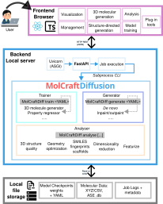

# AutomaticMolCraft

**AutomaticMolCraft** is a browser-based platform for 3D molecular generative design built on [MolCraftDiffusion](https://github.com/pregHosh/MolCraftDiffusion). It runs entirely locally — no cloud account or scripting required.

## What it covers

| Tab | What you can do |
|---|---|
| **3D molecule generation** | Run pretrained diffusion models to generate novel 3D molecules from scratch |
| **Structure-directed generation** | Extend or complete an existing structure using a reference scaffold |
| **Management** | Load, stage, merge, compute derived columns, and export multi-source molecular datasets |
| **Analysis tools** | Enrich datasets with quantum-chemistry calculations, fingerprints, and 2D coordinates |
| **Visualization** | Explore chemical space in linked scatter plots, histograms, and a 3D structure viewer |
| **Model training** | Configure and queue MolCraftDiffusion training and fine-tuning jobs from the browser |
| **Plug-in tools** | Connect external property predictors without touching backend code |

## System architecture

*The browser-based React/TypeScript frontend communicates with a FastAPI backend that manages datasets, model discovery, generation jobs, analysis jobs, exports, and external tool execution. MolCraftDiffusion provides the model-training, sampling, and molecular-analysis routines exposed through the WebUI.*

---

## Background and key concepts

### 3D molecular generative models

Most molecular generative models work with 2D graph or string (SMILES) representations. **3D generative models** instead assign each atom explicit Cartesian coordinates, producing complete atomic geometries directly. This matters because most molecular properties — electronic structure, reactivity, binding pose — depend on 3D shape, not just connectivity. By operating in Cartesian space, these models can encode geometric and physicochemical constraints directly into the generation process.

The generative backbone used by MolCraftDiffusion is an **E(3)-equivariant Diffusion Model (EDM)**: a diffusion model whose denoising network (an equivariant graph neural network, EGNN) respects 3D rotational and translational symmetry. Generation starts from random Gaussian noise and iteratively applies the denoising network to produce a valid 3D geometry.

### Controlled generation

Unconstrained generation samples freely from the learned distribution. Three complementary mechanisms constrain or steer it toward a target:

**Inpainting** — structure-guided generation that modifies a *subset* of atoms. A noise level (denoising strength *d*) is applied to designated masked atoms while the rest are held fixed; the model then denoises only the masked region. Higher *d* allows larger deviations from the reference; lower *d* produces more conservative edits. Suited for fragment replacement and side-chain decoration.

**Outpainting** — structure-guided generation that *grows* new atoms around a fixed scaffold. Core atoms are held fixed while the model generates surrounding atoms from noise. Suited for scaffold decoration and virtual library construction.

**Classifier-free guidance (CFG)** — property-directed generation baked into the model at training time. At inference, conditional and unconditional noise predictions are combined — `ε̃ = (1+w)φ(z,t,y) − wφ(z,t)` — so increasing the CFG scale *w* steers the output more strongly toward a target property *y* (e.g. a specific HOMO–LUMO gap or ionisation potential). Requires a CFG-trained checkpoint.

### MolCraftDiffusion

[MolCraftDiffusion](https://github.com/pregHosh/MolCraftDiffusion) is a modular Python framework that unifies all aspects of 3D molecular diffusion modelling under a single platform: training (from scratch or fine-tuning, with curriculum learning for efficient convergence), generation (unconditional, structure-directed, and property-directed), property regression, and standardised structure quality evaluation. New architectures, guidance mechanisms, and metrics can be added without touching the core codebase.

**AutomaticMolCraft is the browser-based interface to MolCraftDiffusion** — it exposes the full generation, analysis, and training pipeline without requiring any scripting.

**XYZ format** — the coordinate file format used throughout: line 1 = atom count, line 2 = comment, remaining lines = `element x y z` (one atom per line).

## Get started

→ [Installation](installation.md) — set up the environment and download model weights  
→ [Quick Start](quickstart.md) — generate your first molecule in ~15 minutes  
→ [UI Overview](ui-overview.md) — map of all 7 tabs and controls

## Citation

If you use AutomaticMolCraft or MolCraftDiffusion, please cite the [ChemRxiv preprint](https://chemrxiv.org/engage/chemrxiv/article-details/6909e50fef936fb4a23df237).
