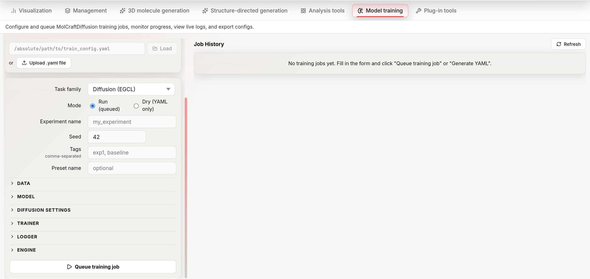

# Model Training

The **Model training** tab exposes the full MolCraftDiffusion training pipeline from the browser.

!!! note "Extended task families"
    The unlock mechanism exists for future gated families. If the server sets `MOLCRAFT_UNLOCK_PASSWORD` (see [Installation](installation.md)), an unlock field appears above the form — enter the password and click **Unlock** to obtain a session token ("Extended models unlocked" is shown on success). Currently every task family in the dropdown is already public, so unlocking has no visible effect on which families are offered.

## Layout

| Column | Contents |
|---|---|
| **Left** (fixed 440 px) | Presets bar, YAML import, experiment metadata, collapsible parameter form |
| **Right** (remaining width) | Job history list |



*The Model training workspace: import or fill in a config on the left, queue the job, and track it in the Job History panel on the right.*

---

## YAML import

Rather than filling the form manually, you can import an existing training YAML:

**From a file path** — paste an absolute path into the text box and press **Enter** or click the arrow button. The backend reads the file and populates every form field.

**From a file upload** — click the upload button and select a `.yaml` or `.yml` file.

Both methods overwrite the current form state entirely. After import you can still edit individual fields before submitting.

---

## Task family

The **Task family** dropdown lists every family from `GET /training/task-families`. Each family belongs to one of five categories, which controls which form sections appear below.

| Category | Families | Description |
|---|---|---|
| `diffusion` | Diffusion (EGCL), Diffusion (EGCL, pretrained defaults), Diffusion (EGT), Tabasco (Flow) | DDPM/flow-based 3D molecule generation |
| `regression` | Regression (EGCL), Regression (eSEN), Regression (EquiformerV2) | Supervised property predictor (used by CFG models for property steering) |
| `ssl3d` | SSL-3D (EGCL), SSL-3D (EGT), SSL-3D (eSEN), SSL-3D (Equiformer) | Self-supervised 3D pre-training (denoising + masking) |
| `vae` | VAE (Equiformer), VAE (Transformer) | Variational autoencoder for latent-space generation |
| `guidance` | Guidance (EGCL), Guidance (eSEN) | Guidance-model training |

---

## Run mode

| Mode | Submit button | Effect |
|---|---|---|
| **Run** | **Queue training job** | Queues a real training job; the backend launches the training process and streams logs |
| **Dry** | **Generate YAML** | Generates and validates the YAML configuration only — no training runs. The YAML is shown inline with a **Copy command** button and a **Download YAML** button |

Use **Dry** to inspect or share the configuration before committing compute.

---

## Form sections

Sections are collapsible (click the section title to toggle). Which sections appear depends on the task family.

| Section | Shown for |
|---|---|
| Data | all |
| Model | all |
| Diffusion settings | diffusion |
| Regression settings | regression |
| SSL-3D settings | ssl3d |
| VAE settings | vae |
| Trainer | all |
| Logger | all |
| Engine | all |

`guidance` families (Guidance (EGCL), Guidance (eSEN)) have no dedicated settings section — only Data, Model, Trainer, Logger, and Engine appear.

---

### Experiment metadata

| Field | Default | Description |
|---|---|---|
| Experiment name | *(required)* | Label used for the output directory and logger run name |
| Seed | 42 | Global random seed for reproducibility |

---

### Data

| Parameter | Default | Description |
|---|---|---|
| Dataset name | *(required)* | Cache key for the processed dataset |
| Data root | `data/` | Base directory the other data paths are resolved against |
| CSV path | *(empty)* | Path to the molecules CSV; leave blank if using ASE DB |
| XYZ directory | *(empty)* | Path to the XYZ geometry folder; required when CSV path is set and ASE DB path is empty |
| ASE DB path | *(empty)* | Path to an ASE `.db` file; overrides CSV path + XYZ directory when set |
| Atom vocabulary | `H, B, C, N, O, F, Al, Si, P, S, Cl, As, Se, Br, I` | Comma-separated element symbols. Molecules containing unlisted elements are excluded unless **Allow unknown** is on |
| Batch size | 48 | Molecules per training step |
| Max atoms | 86 | Molecules with more atoms than this are excluded |
| Train ratio | 0.8 | Fraction used for training; the remainder becomes the validation set |
| With hydrogen | true | Include hydrogen atoms in the geometry |
| Use OHE feature | true | One-hot encode atom type as a feature vector |
| Allow unknown | false | Pass through molecules with elements outside the vocabulary (marked with a special unknown token) |
| Data-efficient collator | true | Use a variable-length batching strategy that reduces padding; improves GPU utilisation on diverse atom-count datasets |

Either CSV path or ASE DB path is required. If using CSV path without an ASE DB, XYZ directory is also required.

---

### Model

| Parameter | Default | Description |
|---|---|---|
| Hidden size | 256 | Embedding dimension for all attention layers |
| Number of layers | 9 | Transformer depth |
| Number of sub-layers | 1 | Sub-layers per transformer block |
| Dropout | 0 | Dropout probability (0 = disabled) |
| Condition names | *(empty)* | Comma-separated property columns to condition on. Non-empty enables the conditioning options in Diffusion settings |
| Attention | true | Enable multi-head self-attention; set to false for a simpler MLP baseline |
| Tanh | true | Apply tanh activation in the output head to bound predicted noise |
| Load weights from | *(empty)* | Path to a checkpoint to initialize model weights from, for fine-tuning |
| Resume checkpoint | *(empty)* | Path to a checkpoint to resume a training run from (optimizer/scheduler state included) |

---

### Diffusion settings

Applies to task families in the `diffusion` category: Diffusion (EGCL), Diffusion (EGCL, pretrained defaults), Diffusion (EGT), and Tabasco (Flow).

| Parameter | Default | Description |
|---|---|---|
| Diffusion steps | 500 | Total forward-process steps T |
| Noise schedule | `polynomial_2` | Variance schedule shape: `polynomial_2`, `cosine_x`, `issnr_1_2`, or `learned` |
| Loss type | `vlb` | Training objective: `vlb` (variational lower bound) or `l2` |
| CFG mask rate | 0 | Fraction of property context randomly masked during training — enables CFG at inference. Set > 0 to train a conditional model |
| Mask value | 5 | Sentinel value substituted for masked/dropped context entries |
| Normalize factors | `1.0, 4.0, 10.0` | Per-channel scaling applied to atom coordinates, atom types, and charges before diffusion |
| Val samples (n_samples) | 48 | Molecules generated per validation generative analysis run |
| Generative analysis | true | Run a sample-quality evaluation at each validation step |
| Use PoseBuster | true | Include PoseBuster validity metrics in the generative analysis |

Shown only when **Condition names** (Model section) is non-empty:

| Parameter | Default | Description |
|---|---|---|
| Normalize condition | `value`, N=10 | Property normalization: `none`, `value` (divide by N), `maxmin`, or `mad` |
| Adapter conditions | *(empty)* | Comma-separated subset of condition names to route through the adapter module |
| Use adapter module | false | Route conditioning through a learnable adapter instead of feature concatenation (see below) |

Also shown, independent of conditioning: **Deploy SP regularizer** toggles the self-paced regularizer subsection below.

#### Conditional training (CFG)

Setting **CFG mask rate** > 0 trains a conditional model compatible with classifier-free guidance (CFG) at inference. During each training step, the property label is randomly dropped with this probability; the model learns both the conditional (`φ(z, t, y)`) and unconditional (`φ(z, t)`) denoising distributions in one pass. At inference, the two predictions are combined as:

```
ε̃ = (1 + w) φ(z, t, y) − w φ(z, t)
```

where `w` is the CFG scale set at generation time. Typical values for CFG mask rate are 0.1–0.3.

**Property normalization** (the **Normalize condition** field above) affects how strongly the conditioning signal contributes to the denoising function and consequently how well CFG guidance transfers to generated structures:

- **`value`** — divide the raw property value by a constant N. Simple but sensitive to the chosen scale.
- **`maxmin`** — rescale to [-1, 1] using the training set's min/max.
- **`mad`** — scale property values by the median absolute deviation of the training set. More robust across different property ranges and has been shown to retain a higher structural validity rate at strong CFG scales compared to fixed scaling.
- **`none`** — use the raw property value unmodified.

Choose the normalization scheme consistently across the generative and regression (property-predictor) models for a given experiment.

**Conditioning mechanism** — MolCraftDiffusion supports two ways to inject the property signal into the denoising network, selected by the **Use adapter module** checkbox:

| Mechanism | How it works | Notes |
|---|---|---|
| **Feature concatenation (Concat.)** — default (Use adapter module off) | The property label `y` is appended directly to the molecular representation before each denoising step: `z = [x, h, y]`. | The conditional variable becomes part of the main noise-prediction input, giving it a stronger gradient during fine-tuning. Generally effective for CFG-guided generation. |
| **Adapter** — Use adapter module on | A learnable MLP maps `y` into the hidden feature space of each EGNN block and adds this contribution only when the property context is present. **Adapter conditions** selects which condition names go through this path. | Attaches the conditioning pathway to an already-trained denoising network; may receive weaker corrective gradients during fine-tuning. |

#### Self-paced (SP) regularizer

A curriculum-learning loss regularizer: per-molecule losses above a threshold are down-weighted or dropped, and the threshold grows over training so harder examples are phased in gradually. Enable with **Deploy SP regularizer**; the fields below then appear.

| Parameter | Default | Description |
|---|---|---|
| SP regularizer | `hard` | Weighting scheme: `hard`, `soft`, or `polynomial` |
| SP lambda | 0 | Initial loss threshold |
| SP lambda 2 | 1000 | Initial threshold for the secondary term |
| SP lambda update value | 1 | Amount added to both lambdas at each update step |
| SP lambda update step | 100 | Training steps between lambda updates |
| SP polynomial p | 1.1 | Exponent used by the `polynomial` regularizer |
| SP warm-up steps | 100 | Training steps before the regularizer starts applying |

!!! note "Flow-matching parameters"
    Form fields for flow-matching-specific parameters (minimum ODE time, integration timesteps, self-conditioning, velocity parameterization) exist in the underlying code but are not currently surfaced by any task family in the dropdown, including Tabasco (Flow) — that family uses the diffusion settings above.

---

### Regression settings

Applies to task families in the `regression` category: Regression (EGCL), Regression (eSEN), Regression (EquiformerV2). Trains a property predictor head on top of the molecular encoder, used later for CFG property steering.

| Parameter | Default | Description |
|---|---|---|
| Target columns | *(required)* | Comma-separated property columns to predict |
| Loss criterion | `mse` | Loss function: `mse` or `mae` |
| Metrics | `mae` | Comma-separated validation metrics |
| MLP layers | 3 | Depth of the property prediction head |
| MLP norm | `batchnorm` | Normalisation inside the MLP: `batchnorm`, `layernorm`, or `none` |
| MLP dropout | 0.2 | Dropout in the prediction head |
| Normalize targets | true | Standardise property targets to zero mean and unit variance before training |

---

### SSL-3D settings

Applies to task families in the `ssl3d` category: SSL-3D (EGCL), SSL-3D (EGT), SSL-3D (eSEN), SSL-3D (Equiformer). Combines 3D coordinate denoising with masked atom-type prediction as a pre-training objective.

| Parameter | Default | Description |
|---|---|---|
| Denoise weight | 1 | Loss weight for the coordinate denoising term |
| Atom mask rate | 0.15 | Fraction of atoms whose type is masked and predicted |
| Atom type weight | 0.5 | Loss weight for the masked atom-type prediction term |
| Sigma min | 0.01 Å | Minimum noise standard deviation added to coordinates |
| Sigma max | 2.0 Å | Maximum noise standard deviation |
| Sigma schedule | `uniform` | Distribution for sampling sigma: `uniform` or `log_uniform` |

---

### VAE settings

Applies to task families in the `vae` category: VAE (Equiformer), VAE (Transformer). Trains a variational autoencoder that encodes molecules into a continuous latent space.

| Parameter | Default | Description |
|---|---|---|
| Latent dim | 8 | Dimensionality of the VAE latent vector |
| Augment noise | 0.1 | Standard deviation of Gaussian noise added to coordinates during training augmentation |
| Augment rotation | true | Apply random 3D rotations to each molecule during training |

---

### Trainer

| Parameter | Default | Description |
|---|---|---|
| Optimizer | `adamw` | `adamw`, `adam`, `amsgrad`, or `radam` |
| Learning rate | 0.0002 | Initial LR |
| Weight decay | 1e-12 | L2 regularisation coefficient |
| Num epochs | 200 | Total training epochs. Leave blank to train by step count instead (see Num steps) |
| Num steps | *(empty)* | Total training steps; overrides Num epochs when set |
| Scheduler | `cosineannealing` | LR schedule: `cosineannealing`, `reducelronplateau`, `steplr`, `onecyclelr`, or `exponentiallr` |
| Validation interval | 3 | Epochs between validation runs |
| EMA decay | 0.9999 | Exponential moving average decay for model weights — EMA weights are used at inference |
| Precision | 32 | Floating-point precision: `32` (FP32), `16` (FP16), or `bf16` |
| Save top-k | 3 | Number of best checkpoints to keep |
| Save every val epoch | false | Also save a checkpoint at every validation epoch, not only on improvement |
| Gradient clip mode | `norm` | `norm` (clip gradient norm) or `value` (clip element-wise) |
| Initial grad norm | 3000 | Target gradient norm for the first step, used to initialise the gradient scaler |
| Monitor metric | *(empty)* | Metric name to track for best-checkpoint selection, e.g. `gen/Validity` |
| Monitor mode | `max` | Whether to keep checkpoints with the highest (`max`) or lowest (`min`) monitored metric |

---

### Logger

| Parameter | Default | Description |
|---|---|---|
| Logger backend | `logging` | `logging` (console/file) or `wandb` (Weights & Biases) |
| Log interval | 2 | Steps between log writes |
| W&B run name | `MolecularDiffusion` | Shown only when backend = wandb. Overrides the auto-generated run name |
| W&B project | `MolecularDiffusion` | Shown only when backend = wandb. W&B project name |
| W&B tags | *(empty)* | Shown only when backend = wandb. Comma-separated tags for the run |

---

### Engine

| Parameter | Default | Description |
|---|---|---|
| Engine type | `original` | `original` (custom training loop) or `lightning` (PyTorch Lightning) |
| Number of workers | 2 | DataLoader worker processes for prefetching. Only shown, and only applied, when Engine type = `lightning` |

---

## Dry mode output

After clicking **Generate YAML**, the rendered configuration appears in a read-only text area below the form. Two buttons are shown:

- **Copy command** — copies a ready-to-run shell command (`MolCraftDiff train --config <path>`) to the clipboard.
- **Download YAML** — saves the configuration as a `.yaml` file.


---

## Job history

Every submitted job — Run and Dry alike — appears in the right column, including the inline result from **Generate YAML**. Each row shows the task family (and preset name, if set) and a status badge (`queued / running / completed / failed / cancelled / dry`).

Click a row to expand it. Three sub-tabs are available:

| Sub-tab | Contents |
|---|---|
| **LOG** | Live-tailing training log. Updates every 3 seconds while the job is running |
| **YAML** | The full training configuration used for this job |
| **INFO** | Job metadata (ID, status, mode, task family, timestamps, config path, output directory, return code, error) and a suggested launch command with a **Copy** button |

### Actions

| Action | When available | What it does |
|---|---|---|
| **Stop** | Queued or running jobs | Cancels a queued job before it starts, or sends SIGTERM to an already-running training process |
| **Clone to form** | Any job | Copies this job's configuration back into the form for re-use or editing |
| **Download YAML** | Any job with a stored config | Saves this job's YAML configuration |
| **Refresh** | Queued or running jobs | Manually reloads this job's status and log (also happens automatically every 2s while any job is active) |
| **Delete** | Any job, including running ones | Removes the job record from history (training output files on disk are not deleted). Deleting a running job does not stop the training process — use **Stop** first |


---

## Configuration presets

The presets bar above the form works identically to the generation presets — see [Presets](generation/presets.md). Presets save the full form state and restore it in one click.
