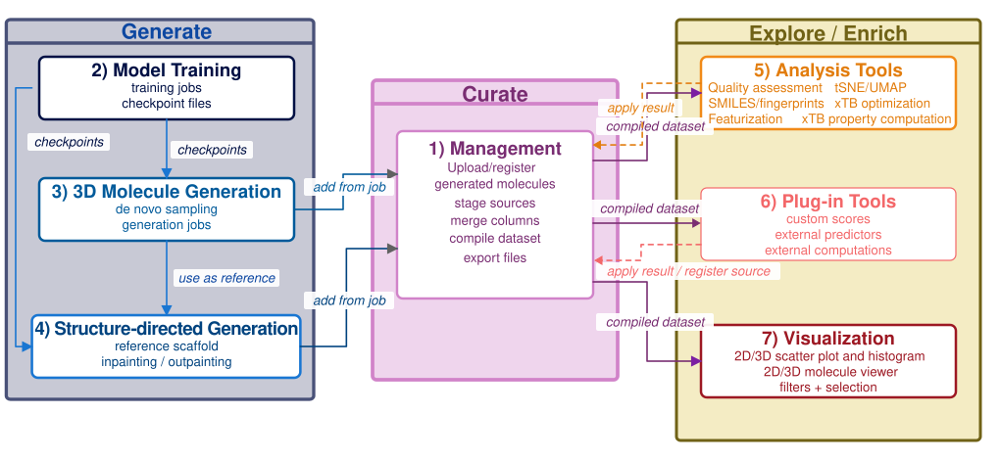
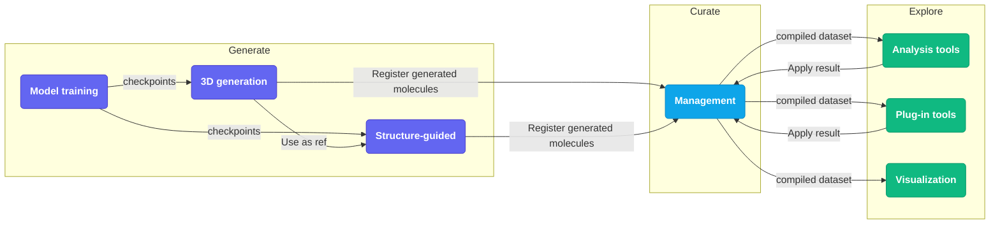

# UI Overview

## Tab bar

The tab bar runs across the top. Each tab is a self-contained workspace.

| Tab | Purpose |
|---|---|
| **Visualization** | Linked scatter plots, histograms, and 3D molecule viewer for exploring the loaded dataset |
| **Management** | Load, stage, merge, and export molecular datasets |
| **3D molecule generation** | Run pretrained diffusion models to generate novel 3D molecules |
| **Structure-directed generation** | Complete or extend an existing structure using a reference scaffold |
| **Analysis tools** | Enrich the dataset with quantum-chemistry calculations, fingerprints, and 2D layout coordinates |
| **Model training** | Configure and queue MolCraftDiffusion training jobs |
| **Plug-in tools** | Run custom external scoring functions or predictors |

---

## Workspace overview

*The interface is organized into task-specific workspaces for Management, Visualization, 3D molecule generation, Structure-directed generation, Analysis tools, Model training, and Plug-in tools, which together cover the main stages of a 3D molecular design workflow.*

---

## How the tabs connect

The central hub is **Management**: generation outputs flow into it, analysis tools enrich it, and Visualization reads from it. Model training produces the checkpoint files that power both generation tabs.

---

## Top bar

The **theme selector** (top-right) cycles through six visual themes (Cosmos, Arctic, Neon Bio, Amber Lab, EPFL, Arcane Study). The choice is saved to browser local storage.

## Toast notifications

Brief status messages (errors, confirmations) appear as overlay toasts and dismiss automatically.

## Dataset state

The currently loaded dataset is shared across all tabs. Loading a new dataset or compiling in **Management** updates what **Visualization** and **Analysis tools** see.
