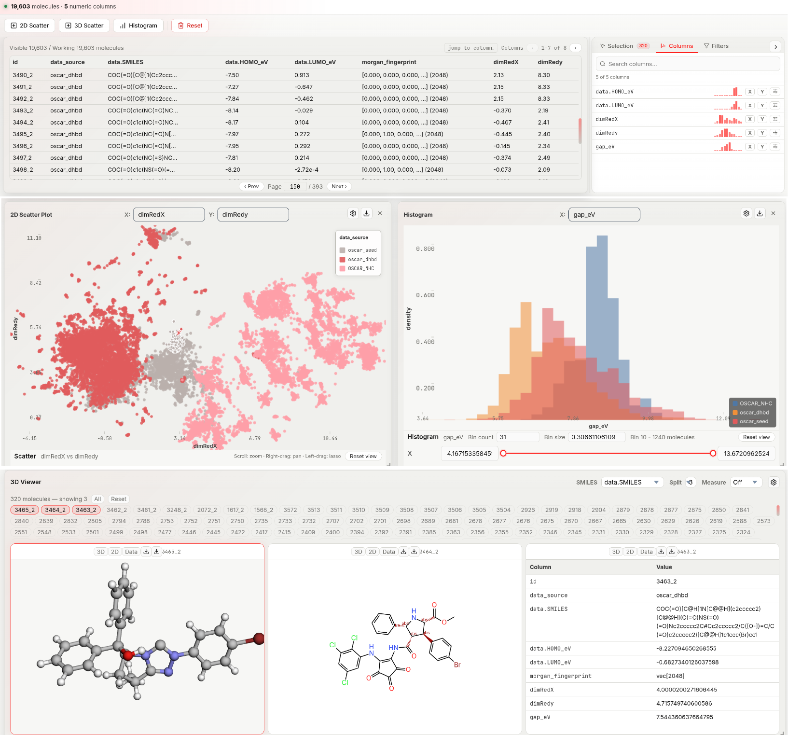

# Visualization

The **Visualization** tab is a multi-panel workspace for exploring a compiled dataset. All panels share a **selection state**: interacting with any panel highlights the same molecules across all others and in the molecule viewer.

*Linked plots, filters, tables, and molecular viewers share the same molecule-selection state, allowing property trends and structural subsets to be inspected within a single interface.*

!!! note
    A dataset must be loaded before any panels can be used — register and compile one in [Data Manager](data-manager.md) (the **Management** tab) first.

---

## Adding and arranging panels

The **action bar** (below the tab bar) provides:

- **2D Scatter** — requires ≥ 2 numeric columns
- **3D Scatter** — requires ≥ 3 numeric columns
- **Histogram** — requires ≥ 1 numeric column
- **Reset** — clears the dataset, staged sources, descriptors, computed columns, filters, selections, and plots for the current session, after a confirmation dialog

New panels are appended below existing ones. **Drag** a panel by its title bar to reposition it. **Drag any edge or corner** to resize it. Panels can be overlapped or tiled freely.

---

## 2D Scatter plot

Each point represents one molecule. Rendered with GPU-accelerated deck.gl.

### Changing axis bindings

Click the **X** or **Y** axis label directly on the plot to open a column picker. Select any numeric column; the plot re-renders immediately.

### Interactions

| Action | How |
|---|---|
| **Lasso select** | Left-click drag on empty space — draw a freeform polygon; all points inside become selected on release |
| **Select one point** | Left-click a point |
| **Add point to selection** | Ctrl (Windows/Linux) or ⌘ (macOS) + click a point |
| **Clear selection** | Lasso an empty area, or left-click on empty space |
| **Pan** | Right-click drag |
| **Zoom** | Scroll wheel |

Lasso is the primary multi-selection tool. The lasso polygon activates only after the cursor has moved more than ~6 pixels from the starting point (short clicks are treated as single-point selection instead).

### Plot settings

Click the **⚙** icon on any scatter panel (press **Esc** to close the modal).

#### Marker Size

| Option | Range | Description |
|---|---|---|
| Fixed size | 1–24 px (default 3) | Uniform radius for all points |
| Size by | numeric column | Map a column value to point radius; larger values = larger points |

#### Marker Shape *(2D only)*

| Option | Description |
|---|---|
| Fixed shape | Circle, Square, Diamond, or Triangle |
| Shape by | Bind shape to any column — each unique value gets its own shape |

#### Marker Color

| Option | Description |
|---|---|
| Fixed color | One color for all points (color picker) |
| Color source *(2D only)* | Fixed, Column, or Density / frequency — selects what feeds Color by. In 3D, Color by is bound directly to a column with no separate source picker |
| Color by | Bind to a numeric column (continuous ramp) or categorical column (discrete palette) |
| Palette | Color ramp when Color by is numeric: **Teal Sunset**, Viridis, Plasma, Cividis, Turbo (renamed to contrast variants when Categorical is on) |
| Show colorbar | Toggle the colorbar legend on the plot |
| Categorical | Force categorical (discrete) color interpretation of a numeric column |

**Density / frequency coloring** *(2D only)*, when Color source is set to Density / frequency:

| Option | Description |
|---|---|
| Method | Bin frequency or KDE density |
| Grid resolution | Auto, or a fixed grid from 24×24 to 96×96 |
| Smoothing | KDE bandwidth slider (KDE method only) |
| Color scale | Linear or Log |

#### Graphical View

| Option | Default | Description |
|---|---|---|
| Background | Theme color | Canvas background |
| X / Y axis | on | Show/hide axis lines and labels *(2D only)* |
| Tick labels | on | Show/hide numeric tick labels *(2D only)* |
| Grid | off | Overlay a reference grid *(2D only)* |
| Grid density | Auto | Light or Dense when grid is on |
| Preserve aspect | off | Lock equal pixel-per-unit scale on both axes *(2D only)* |
| Dim unselected | off | Fade all points outside the current selection |
| Point opacity | 0.86 | Slider 0.1–1.0 |

**View buttons** (also in the settings modal):

| Button | Effect |
|---|---|
| Fit all | Zoom to show all data points |
| Fit visible | Zoom to the current filter-visible points only |
| Reset zoom | Return to the initial auto-fit view |

#### Per-axis settings (X, Y; Z for 3D)

Each axis has its own section:

- **Label** — override the default column name with custom text
- **Range min / max** — clip the visible range without filtering the underlying data

#### Statistical View

Enable **Show summary and correlation** to overlay mean, standard deviation, and Pearson r for the two plotted axes.

---

## 3D Scatter plot

Identical axes, interactions, and settings to the 2D scatter plot, with an added **Z axis** binding. Shape settings are not available in 3D.

---

## Histogram

Bins one numeric column into bars. Click a bar to select all molecules in that bin range.

### Histogram settings

Click **⚙** on the histogram panel.

| Option | Default | Description |
|---|---|---|
| Bin count | 40 | Number of bars (1–5 000) |
| Bin size | — | Explicit bin width; overrides bin count when set |
| Split by | None | Overlay separate histograms per value of a categorical column |
| Bar fill color | — | Interior color |
| Bar border color | — | Outline color |
| Bar opacity | 0.75 | Slider 0.05–1.0 |
| Background | Theme color | Canvas background |
| X / Y axis | on | Show/hide axis lines |
| Tick labels | on | Show/hide numeric tick labels |
| Grid | off | Reference grid |
| Grid density | Auto | Light or Dense when grid is on |
| Highlight selected bin | on | Emphasise the bar(s) containing selected molecules |
| Dim unselected bins | off | Fade bars with no selected molecules |
| Show stats | off | Overlay mean and standard deviation |

**View buttons** (also in the settings modal): **Fit all** and **Reset zoom**, same as the scatter plot.

---

## 3D Structure Viewer

The molecule viewer renders the 3D geometry of each selected molecule. It supports viewing up to 9 molecules simultaneously in a configurable split layout.

### Viewer controls (header bar)

| Control | What it does |
|---|---|
| **SMILES column** dropdown | Choose which dataset column contains SMILES strings for 2D rendering |
| **Split** (1–9) | Number of panes shown simultaneously (1×1 up to 3×3 grid) |
| **Measure mode** | Off / Distance / Angle — enables atom-click measurement |
| **Clear** | Remove all measurement annotations (appears when measure mode is active) |
| **⚙ Settings** | Open the viewer settings modal |

### Selecting which molecules to display

When molecules are selected (via plots or lasso), a row of **molecule ID pills** appears below the header. Each pill represents one selected molecule.

- **Click a pill** to toggle it on/off in the viewer panes
- **All** — load up to 9 selected molecules at once
- **Reset** — clear the display (pills remain in the selected set; they just stop showing in panes)

The text shows `N molecule(s) — showing M` to indicate selection size vs. display size.

### Pane view modes

Each pane has three view modes toggled by buttons in the pane header:

| Mode | What is shown |
|---|---|
| **3D** | Interactive 3D ball-and-stick / sticks / spacefill rendering |
| **2D** | 2D structural diagram rendered from the SMILES column |
| **Data** | Table of all property values for that molecule |

**2D mode** requires a valid SMILES string in the selected SMILES column. If SMILES is absent or not renderable, a status message explains why.

**Data mode** shows every column from the dataset in a two-column table (Column / Value). Null values are displayed as `—`.

### Measurements

Set **Measure mode** to **Distance** or **Angle**, then click atoms in a 3D pane:

- **Distance**: click 2 atoms → shows the Å distance between them
- **Angle**: click 3 atoms → shows the bond angle in degrees

Clicked atoms are highlighted in cyan, magenta, and yellow in sequence. Click **Clear** to remove all annotations or switch the mode dropdown to reset.

### Per-pane downloads

Each pane header has two download buttons:

| Button | Output |
|---|---|
| SVG | Server-rendered 3D projection as a vector SVG (via OpenBabel) |
| PNG | Screenshot of the current 3D canvas |

### Viewer settings

| Setting | Options | Description |
|---|---|---|
| Render style | Ball + stick / Sticks / Spacefill | 3D display style |
| Show hydrogens | on / off | Show or hide hydrogen atoms in 3D |
| Atom labels | Off / Atomic index / Atomic number / Atomic type | Label each atom in the 3D view |
| Background | color picker | Canvas background for all panes |

---

## Data table

A paginated table of all dataset rows (50 rows per page, with a page-number jump box) and paginated columns (7 columns per page, with a "jump to column" search box). Selected/picked rows are highlighted.

- **Click a row** — select that molecule (also updates the 3D viewer's active pane)
- **Ctrl/Cmd + click a row** — add/remove it from the multi-molecule pick set used by the 3D viewer

Columns are not sortable or resizable.

---

## Filter panel

Found in the **Filters** tab of the info panel next to the data table (alongside **Selection** and **Columns** tabs). Row-level filters apply across all panels in real time. The active filter scope is also used when exporting from the [Data Manager](data-manager.md).

| Filter type | Applies to | How it works |
|---|---|---|
| **Range** | Numeric columns | Slider with min/max bounds; rows outside the range are hidden |
| **Contains** | Text columns | Case-insensitive substring match |
| **Boolean** | Boolean columns | Three-state toggle: any / true / false |
| **SMARTS** | SMILES column | Substructure match using a SMARTS pattern |
| **Similarity** | SMILES column | Tanimoto similarity ≥ threshold against a query SMILES |

**SMARTS** (SMiles ARbitrary Target Specification): a pattern language for substructure queries (e.g. `[#6]~[#7]` matches any carbon bonded to any nitrogen by any bond type).

**Tanimoto similarity**: ranges 0–1 (0 = nothing in common, 1 = identical) based on shared Morgan fingerprint bits between the query and each dataset molecule.

