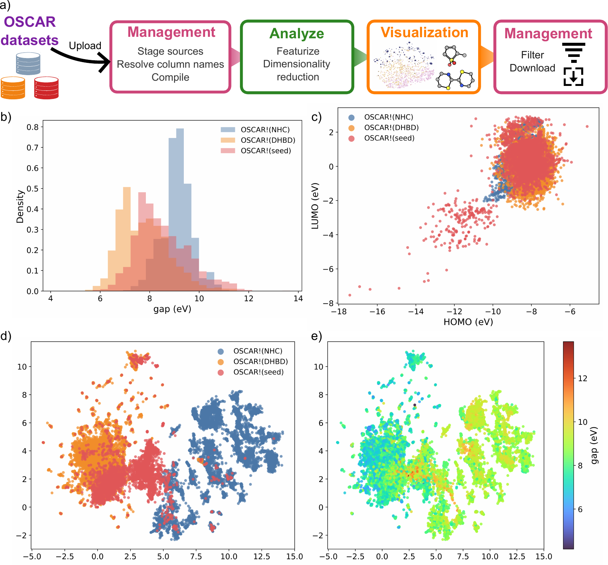
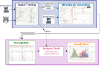
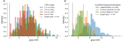

# Workflows

This page describes common end-to-end usage patterns. Each workflow links to the relevant tab documentation for parameter details.

---

## 1. Generate → Analyze → Visualize

The most common workflow: produce a batch of molecules, enrich them with properties, then explore the chemical space.

1. **[3D Generation](../generation/index.md)** — run a de-novo job and inspect the generated XYZ files in the Results panel.
2. **[Data Manager](../data-manager.md)** — use **Add generated molecules**, click **Register generated molecules**, then **Compile dataset**.
3. **[Analysis tools](../analysis-tools.md)** — run **XYZ to SMILES** (required first), then **XTB electronic properties** or **Predict properties**.
4. Apply results to the dataset.
5. **[Analysis tools](../analysis-tools.md)** — run **Featurize** (SOAP), then **Dimensionality reduction** (UMAP) to produce 2D layout columns.
6. **[Visualization](../visualization.md)** — create a 2D scatter plot with UMAP coordinates on the axes, color by energy or HOMO–LUMO gap.

---

## 2. Property-targeted generation

Generate molecules steered toward a specific property value using CFG.

1. Choose a **CFG** model in [3D Generation](../generation/index.md) (labelled "CFG" in the model list).
2. Set **CFG scale** > 1 (start with 2–3) and enter the target value for each property.
3. Optionally set a **Negative target** to steer *away from* an undesired value.
4. Run multiple jobs with different seeds to build a diverse set.
5. Proceed with steps 2–6 from workflow 1 to compare the generated set against an unconditional baseline.

---

## 3. Scaffold extension (outpaint)

Extend a known fragment into a complete molecule.

1. In **[Structure-directed generation](../generation/structure-guided.md)**, load a reference `.xyz` scaffold.
2. Set mode to **Outpaint**.
3. Click the atoms that form the attachment point(s) — these are held fixed.
4. Set **Connector bonds** for each selected atom.
5. Set **Fixed atom count** to scaffold atoms + desired extension size.
6. Generate, then use **Use as ref** (→) to feed a promising result back as a new scaffold for further extension.

---

## 4. Dataset curation and export

Curate a mixed-source dataset for downstream modelling.

1. **[Data Manager](../data-manager.md)** — stage each source (CSV + XYZ folder, ASE .db, or generated output folder).
2. Per-source: rename or drop columns to harmonise the schema.
3. Compile with **duplicate-ID = rename** and **column-conflict = merge**.
4. **[Analysis tools](../analysis-tools.md)** — run **Validity and connectivity metrics** to flag problematic geometries.
5. **[Visualization](../visualization.md)** — use a **Boolean filter** on validity columns to exclude invalid molecules.
6. **Data Manager** → **Download dataset** → select **Filtered view** and click **Download ASE .db** for downstream use.

---

## 5. Multi-source dataset curation and property-space exploration

This workflow uses AutomaticMolCraft as a standalone curation environment — no generative model is required. It is illustrated in the paper using three OSCAR organocatalyst sources (OSCAR-NHC, OSCAR-DHBD, and OSCAR-seed).

### Steps

*(a) OSCAR-NHC, OSCAR-DHBD, and OSCAR-seed sources are uploaded, staged, reconciled, compiled, featurised, projected, filtered, and exported through the Management, Analysis tools, and Visualization workspaces. (b) Source-resolved distribution of the computed HOMO–LUMO gap. (c) HOMO–LUMO property-space projection, coloured by source. (d–e) Two-dimensional fingerprint projection coloured by source and by gap value.*

**Stage and reconcile sources**

1. Open the **[Data Manager](../data-manager.md)** tab.
2. Register each source (CSV + XYZ folder or ASE `.db`) and assign a short source label (e.g. `NHC`, `DHBD`, `seed`).
3. In each source flashcard, rename or exclude columns to harmonise the schema across sources. If two sources use different column names for the same quantity, rename both to a shared name before compiling.

**Compute derived columns before compilation**

4. If a derived quantity is needed (e.g. a HOMO–LUMO gap from separate HOMO and LUMO energy columns), click **Computed** on the staged source, choose the two operand columns and the operator (`-`), and name the output column (e.g. `gap_eV`). The computed column participates in compilation like any other selected column.

**Compile**

5. Set **duplicate-ID policy** = `rename` and **column-conflict policy** = `merge`, then click **Compile dataset**.
6. After compilation the header card shows the total molecule and column count across all sources. The `data_source` column records which source each row came from.

**Featurize and project**

7. Open **[Analysis tools](../analysis-tools.md)**. Run **XYZ to SMILES** to add `smiles` and `morgan_fp` columns.
8. Run **Dimensionality reduction** (UMAP, metric = `cosine`) on the `morgan_fp` column to produce `dim_red_x` / `dim_red_y` coordinates.
9. Apply both results to the dataset.

**Explore and filter**

10. Open **[Visualization](../visualization.md)**. Add:
    - A **Histogram** on the `gap_eV` column to see the property distribution per source (color by `data_source`).
    - A **2D Scatter** with `homo` / `lumo` on the axes to inspect the property-space structure.
    - A **2D Scatter** with `dim_red_x` / `dim_red_y` on the axes, colored by `data_source` or `gap_eV`, to see the chemical-space layout.
11. Brush or lasso a region of interest in any plot — the selection propagates across all panels and into the 3D molecule viewer.
12. Use the **Range filter** on `gap_eV` in the filter panel to define property subsets (e.g. low-gap ≤ 7.0 eV, high-gap ≥ 9.0 eV).

**Export**

13. With a filter active, return to **Data Manager** and choose **Filtered view** in the export panel. Download as **CSV + XYZ zip** or **ASE .db** for downstream modelling.

---

## 6. Conditional generation benchmarking

This workflow uses AutomaticMolCraft to run a property-directed generation benchmark — comparing different conditioning strategies and hyperparameters using a shared, traceable dataset state. It is illustrated in the paper using conditional HOMO–LUMO gap generation on the FORMED dataset.

### Overview

The key idea is that AutomaticMolCraft keeps model configuration, generated molecules, quality metrics, and predicted properties in one compiled dataset, so all runs can be compared side-by-side in Visualization without manually reconciling output folders.

*Model Training is used to configure and train the conditioned diffusion models and the HOMO–LUMO gap regressor. The 3D Molecule Generation workspace samples molecules from the trained conditional checkpoints, Management registers the generated structures and benchmark metadata as labelled dataset sources, Analysis tools perform geometry optimisation and property prediction, and Visualization supports comparison of generated molecules and derived descriptors in linked plots and molecular viewers.*

### Steps

**Train conditional models**

1. Open the **[Model Training](../training.md)** tab.
2. Select task family `diffusion`.
3. Set **Context mask rate** > 0 (e.g. 0.2) — this randomly drops the property label during training, enabling classifier-free guidance at inference.
4. Configure the dataset path, atom vocabulary, and training hyperparameters. Use **Dry** mode first to validate the generated YAML before committing compute.
5. Submit separate training runs for each configuration you want to compare (e.g. different conditioning strategies or normalization schemes). Each run appears in the job history and produces a checkpoint under `MOLCRAFT_MODELS_DIR`.
6. If property prediction is needed downstream, also train a **regression** model (task family = `regression`) on the same dataset and property column.

**Generate with property targets**

7. Open **[3D Generation](../generation/index.md)**. Select a trained conditional checkpoint (labelled **CFG** in the model list).
8. Set a **CFG scale** (e.g. 1–3) and enter the property target (e.g. HOMO–LUMO gap = 3 eV for a low-gap target, or 15 eV for a high-gap target).
9. Run the job and inspect generated structures in the split viewer.
10. Repeat for each combination of checkpoint, target value, and CFG scale you want to benchmark. Keep **seed** fixed across runs for a fair comparison.

**Register and compile**

11. Open **[Data Manager](../data-manager.md)**. For each generation job, click **Add generated molecules**, select the job, and set a **Data source label** that encodes the experimental conditions (e.g. `concat_mad_cfg2_gap3`).
12. Once all runs are staged, compile with **duplicate-ID = rename** so molecules from different runs are not merged.
13. Add any supplementary benchmark metadata as a separate CSV source (e.g. a table of model names, conditioning method, normalization scheme) and join it via the source label.

**Analyze: quality checks and property prediction**

14. Open **[Analysis tools](../analysis-tools.md)**.
15. Run **Validity and connectivity metrics** (metric set = `posebuster`) to flag geometrically invalid structures. Apply the result.
16. Run **XTB geometry optimization** (level = `gfn2`) on valid structures. Optionally register the optimised geometries as a new source or replace in-place.
17. Run **Predict properties** using the trained regression checkpoint to add predicted HOMO–LUMO gap values.
18. Apply all results to the active dataset.

**Compare in Visualization**

19. Open **[Visualization](../visualization.md)**. Add plots with:
    - **X axis**: CFG scale (or model label), **Y axis**: predicted HOMO–LUMO gap — to see whether the model shifts molecules toward the target.
    - **Color by**: PoseBuster pass/fail boolean column — to inspect the quality–guidance trade-off.
    - A **Histogram** on the gap column, colored by source label, to compare distributions across runs.
20. Use lasso selections to inspect 3D structures from specific runs side-by-side in the molecule viewer.

*(a) Effect of CFG scale on HOMO–LUMO gap targeting and molecular-quality checks for the Concat. model with fixed gap scaling. (b) Comparison of conditioning and normalization choices, showing the target-dependent response of the Concat. model and the improved quality retention obtained with MAD normalization.*

### What to look for

- **Guidance effectiveness**: does increasing CFG scale shift the predicted property toward the target? Weak conditioning strategies (e.g. adapter-based conditioning under some settings) may show little target-dependent response.
- **Quality cost**: higher CFG scales typically reduce the fraction of structures passing PoseBuster checks. MAD normalization of property values has been shown to retain a higher validity rate than fixed scaling at equivalent CFG strengths.
- **Source label traceability**: the `data_source` column keeps each run's provenance intact throughout the compiled dataset, so all comparisons remain traceable.
